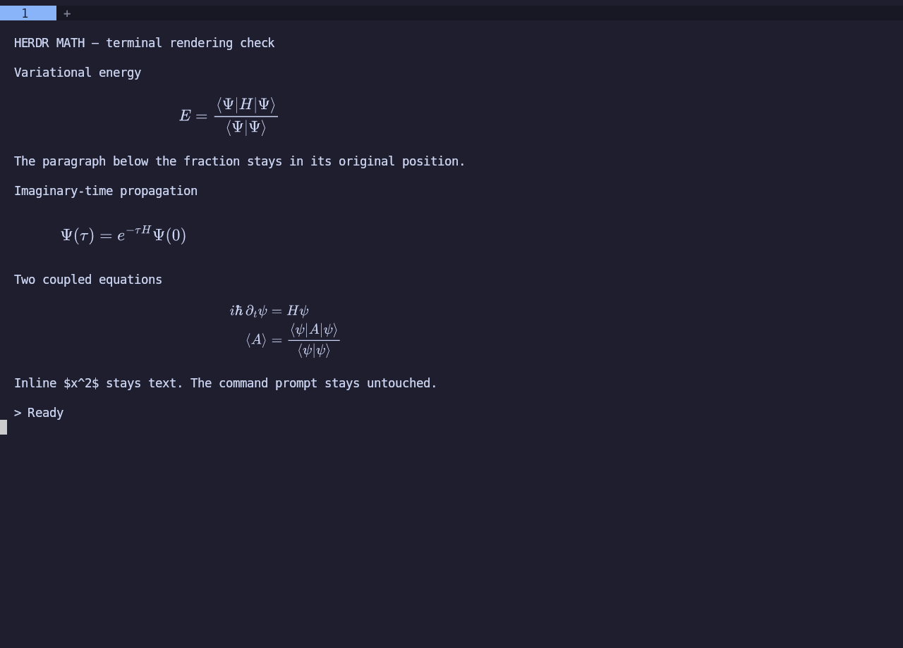

# herdr-math

Render LaTeX display equations directly inside [Herdr](https://herdr.dev) terminal panes using MathJax and Resvg.

The plugin reads visible terminal text. It works independently of agent APIs, session files, and authentication. An optional [writing skill](skills/herdr-math/SKILL.md) explains how any agent can write equations for it.



## Install

Requires Node.js 20+, npm, Herdr 0.8.2+, and a Kitty-graphics-compatible outer terminal. Tested on Linux with Kitty 0.45.0; macOS is declared but has not been visually tested.

```sh
herdr plugin install liambern/herdr-math
```

Installation runs `npm ci` and enables `kitty_graphics = true` in your Herdr configuration, using the setting location reported by your installed Herdr binary. Other settings and comments are preserved.

Rendering starts automatically when Herdr starts and follows the active pane. When installing into an already-running session, switch panes once to start it. No per-pane activation is needed.

If graphics were previously disabled, the existing session may require a compatible terminal reattach or a server restart before graphics become available. The installer does not restart your server or interrupt agents. Run Herdr inside a Kitty-graphics-compatible terminal, such as Kitty.

## Use

Ask your agent for equations. To disable rendering, use `herdr plugin disable herdr-math`; re-enable it with `herdr plugin enable herdr-math` and switch panes. The renderer clears its images when disabled or uninstalled.

Install the [harness-independent writing skill](skills/herdr-math/SKILL.md) through the [Skills CLI](https://github.com/vercel-labs/skills):

```sh
npx skills add liambern/herdr-math --skill herdr-math -g
```

`-g` makes the skill available across projects for the agents you select. This installs writing instructions; the Herdr plugin above provides the rendering. To inspect the available skill without installing it, use `npx skills add liambern/herdr-math --list`.

Alternatively, ask agents to write standalone display environments, outside Markdown code fences:

```latex
\begin{equation*}
E = \frac{\langle\Psi|H|\Psi\rangle}{\langle\Psi|\Psi\rangle}
\end{equation*}
```

The renderer also recognizes `align`, `gather`, and `multline` environments, with or without stars, bracket display delimiters, and double-dollar blocks. Standalone environments are preferred: in our Antigravity test they survived its formatter, while dollar-delimited equations were converted to Unicode before Herdr saw them.

## Behavior and limitations

- Images cover the original source rectangle; they do not reserve additional rows or reflow paragraphs. Spread tall equations across several source lines.
- Inline, incomplete, invalid, partially visible, and unreadably cramped equations remain text. Keep source lines short enough to avoid wrapping inside TeX commands.
- The source remains available for copying. Only delimiters still present in the terminal can be detected; the plugin cannot recover Markdown already transformed by a harness.
- Equations use a dark background and light text. The screenshot shows the matching Catppuccin-style colors.
- Focus events start rendering the new pane immediately. Images travel over a persistent raw-pixel graphics stream; unchanged screens are not repeatedly uploaded. The last eight screens are cached, and outlined equations skip system-font loading.
- Host scrollback events shift the cached image by the reported row offset before the next text snapshot is rendered. Agent interfaces that scroll by redrawing their own screen may not emit host scrollback events; those changes are detected from visible text. Brief transitions remain possible.

## If equations still appear as plain text

The writing skill must be installed for the agent you are using. Try asking it to use `herdr-math` for one equation. If it still emits Unicode, check for an older instruction or saved preference forbidding LaTeX. Update that preference to allow LaTeX display environments in Herdr; installing a renderer cannot override agent instructions. Existing conversations may need the corrected preference stated explicitly.

## Development and verification

From the repository root:

```sh
npm ci
npm test
herdr plugin link "$PWD"
```

Seven automated tests cover scroll-offset repositioning before a blocked text read completes, stream framing and cleanup, installation configuration, active-pane switching, row/column placement, code fences, incomplete input, invalid TeX, macro isolation, and connection closure. On Herdr 0.9.0 with Kitty under Xvfb, eight screen-capture trials measured 27–36 ms from newly visible pane text to its rendered equation, and eight wheel-scroll trials measured 37–90 ms from input to the image at its new position. These are local measurements, not guarantees for other terminals or agent TUIs.

Automatic startup and restart were checked in an isolated Herdr session, including startup before any panes exist. The original rendering action was exercised in an isolated Herdr 0.8.2 / Kitty 0.45.0 session under Xvfb, with visual checks of rendering, resizing, scrolling, and image cleanup. `test/live.mjs` provides the interactive terminal fixture for those checks.

The rendering scale follows [pi-math's architecture](https://github.com/Fadouse/pi-math/blob/main/docs/ARCHITECTURE.md): one MathJax ex is approximately half a terminal cell's height. This implementation is independent of Pi's TUI.

## License

MIT. See [LICENSE](LICENSE).
